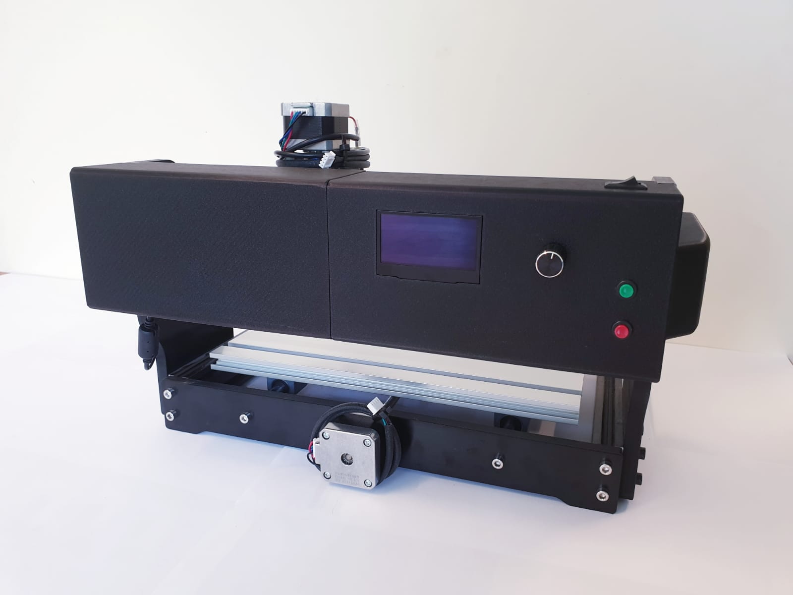

  

    
  

  <b><h3> Automatisierungstechnik Projekt aus dem Jahr 2025 </h3></b>
  
 Demonstrator für einen Schrittmotor mit <a href="https://www.arduino.cc"> Arduino-Ansteuerung </a>

 

# Betreuer: 
Prof. Dr. Elmar Wings

# Autoren (Name, Vorname, Matrikelnummer):
Crety, Chantal, 7025255
Mey, Hannah, 7024688
Perewersenko, Jessica, 7024880

# Projektbeschreibung: 
Im Rahmen dieses Projekts wurde ein vorhandener CNC-Tisch erweitert, um einen seiner Schrittmotoren als Demonstrator mit variabler Geschwindigkeitsregelung zubetreiben. 
Ziel war es, die technische Integration und Ansteuerung über einen Arduino Nano 33 BLE Sense umzusetzen und gleichzeitig eine benutzerfreundliche Bedienoberfläche zu schaffen.

# Aufgabenstellung:
Die Hauptaufgabe bestand darin, einen Schrittmotor des CNC-Tisches in mehreren Geschwindigkeitsstufen betreiben zu können. 
Die Steuerung sollte über einen Arduino Nano 33 BLE Sense erfolgen, wobei die Auswahl der Geschwindigkeit über Bedienelemente möglich sein sollte. 
Zusätzlich sollte ein optischer Geschwindigkeitssensor vom Typ LM393 die Drehzahl erfassen und zur Kontrolle auf einem Display ausgeben.

# Verzeichnisstruktur: 

## Autor und README
- [Author-Excel](author.xlsx)
  - Excel-Datei in der persönliche Daten über die einzelnen Gruppenmitglieder wiederzufinden sind
- [README](README.md)

## Service- und Entwicklerdocumentation 
- [Service- und Entwicklerdocumentation](DemonstratorSchrittmotor/Entwicklerdokumentation/System/Nano33BLESense)
- [Inhalte](DemonstratorSchrittmotor/Entwicklerdokumentation/Contents/General)
  - Ort an dem sich die Tex-Dateien für die einzelnen Kapiteln der Service- und Entwicklerdocumentation befinden
- [Gestaltung](DemonstratorSchrittmotor/Entwicklerdokumentation/General)
  - In diesem Ordner sind Dateien, zur Gestaltung der Service- und Entwicklerdocumentation
- [Bilder](DemonstratorSchrittmotor/Entwicklerdokumentation/Images)
  - Ablage der Bilder, die in der Service- und Entwicklerdocumentation benutzt werden
- [Tikz](DemonstratorSchrittmotor/Entwicklerdokumentation/tikz)
  - Tex-Dateien zur Ersetllung von Tikz-Diagrammen oder Zeichnungen
- [Service- und Entwicklerdocumentation-PDF](DemonstratorSchrittmotor/Entwicklerdokumentation/System/Nano33BLESense.pdf)

## Verwendeter Code
- [Code](DemonstratorSchrittmotor/Entwicklerdokumentation/Code)
- [Arduino](DemonstratorSchrittmotor/Entwicklerdokumentation/Code/Arduino)
 - Testprogramm für den Arduino
- [DemonstratorSchrittmotor](DemonstratorSchrittmotor/Code/DemonstratorSchrittmotorProgramm)
 - Fertiges Programm für den Arduino
- [Nano33BLESense](DemonstratorSchrittmotor/Entwicklerdokumentation/Code/Nano33BLESense)
 - Testprogramm für den Nano33BLESense
- [Encoder](DemonstratorSchrittmotor/Entwicklerdokumentation/Code/Testprogramme/MicroswitchTest)
 - Testprogramm für den Mikroendschalter
- [html](DemonstratorSchrittmotor/Entwicklerdokumentation/Code/Testprogramme/OLED)
 - Testprogramm für das OLED Display
- [latex](DemonstratorSchrittmotor/Entwicklerdokumentation/Code/Testprogramme/OnOffTest)
 - Testprogramm für den Ein/Aus Schalter
- [LED](DemonstratorSchrittmotor/Entwicklerdokumentation/Code/Testprogramme/SpeedsensorTest)
 - Testprogramm für den Geschwindigkeitssensor
- [OLEDDisplay](DemonstratorSchrittmotor/Entwicklerdokumentation/Code/Testprogramme/StufenDrehschalter)
 - Testprogramm für den Drehschalter
- [Stepper](DemonstratorSchrittmotor/Entwicklerdokumentation/Code/Testprogramme/TestPushButton)
 - Testprogramm für den Start-Knopf
- [Taster](DemonstratorSchrittmotor/Entwicklerdokumentation/Code/Testprogramme/TestPushButtonInterrupt)
 - Testprogramm für den Stopp-Knopf

## Montageanleitung (sämtliche Inhalte und die verwendeten Bilder)
- [Montageanleitung](DemonstratorSchrittmotor/Montageanleitung)
- [Inhalte](DemonstratorSchrittmotor/Montage/Chapters)
  - Ort an dem sich die Tex-Dateien für die einzelnen Kapiteln der Montageanleitung befinden
- [Gestaltung](DemonstratorSchrittmotor/Montageanleitung/General)
  - In diesem Ordner sind Dateien, zur Gestaltung der Montageanleitung
- [Bilder](DemonstratorSchrittmotor/Montageanleitung/Images)
  - Ablage der Bilder, die in der Montageanleitung benutzt werden
- [3DDruck](DemonstratorSchrittmotor/Montageanleitung/3D-Print)
  - CAD, STL und GCode Dateien für den 3D Druck
- [PDF](DemonstratorSchrittmotor/Montageanleitung/MontageAnleitung.pdf)

## Demontageanleitung (sämtliche Inhalte und die verwendeten Bilder)
- [Demontageanleitung](DemonstratorSchrittmotor/Demontageanleitung)
- [Inhalte](DemonstratorSchrittmotor/Demontageanleitung/Chapters)
  - Ort an dem sich die Tex-Dateien für die einzelnen Kapiteln der Demontageanleitung befinden
- [Gestaltung](DemonstratorSchrittmotor/Demontageanleitung/General)
  - In diesem Ordner sind Dateien, zur Gestaltung der Demontageanleitung
- [Bilder](DemonstratorSchrittmotor/Demontageanleitung/Images)
  - Ablage der Bilder, die in der Demontageanleitung benutzt werden
- [PDF](LaTeXTemplate/Demontageanleitung/DemontageAnleitung.pdf)
  
## Verwendete Quellen und Bib-file (Datenblätter und Literatur in PDF)
- [Dokumente](DemonstratorSchrittmotor/MLBib)
- [Datenblätter](DemonstratorSchrittmotor/Documents/Datenblätter)
  - Unter diesem Pfad befinden sich die Datenblätter, die für die Dokumentation benötigt wurden
- [Literatur](DemonstratorSchrittmotor/MLBib/Literature.bib)
  - Hier befindet sich die verwendete Literatur
- [Bibliothek](DemonstratorSchrittmotor/Documents/Jetson.bib)
- [Bibliothek](DemonstratorSchrittmotor/Documents/MyLiterature.bib)
  - Citavi Bibliothek mit allen genutzten Quelleinträgen

## Das Handbuch für den Demonstrator (sämtliche Inhalte und die verwendeten Bilder)
- [Handbuch](DemonstratorSchrittmotor/Handbuch)
- [Inhalte](DemonstratorSchrittmotor/Handbuch/Chapters)
  - Ort an dem sich die Tex-Dateien für die einzelnen Kapitel des Handbuches befinden
- [Gestaltung](DemonstratorSchrittmotor/Handbuch/General)
  - In diesem Ordner sind Dateien, zur Gestaltung des Handbuches
- [Handbuch-PDF](DemonstratorSchrittmotor/Handbuch/Handbuch.pdf)

## Das Poster zum Projekt (sämtliche Inhalte und die verwendeten Bilder)
- [Poster](DemonstratorSchrittmotor/Poster)
- [Bilder](DemonstratorSchrittmotor/Poster/images)
  - Ablage der Bilder, die im Poster benutzt werden
- [Poster-PDF](DemonstratorSchrittmotor/Poster/Schrittmotor_Poster.pdf)

## Literaturverzeichnis als Präsentation
- [Bilder](DemonstratorSchrittmotor/Literatur/images)
  - Coverbilder der Quellen
- [Hintergrundbilder](DemonstratorSchrittmotor/Literatur/img)
- [Folien](DemonstratorSchrittmotor/Literatur/slides)
- [Literaturverzeichnis-PDF](DemonstratorSchrittmotor/Literatur/Literaturverzeichnis.pdf)

## Schnelleinstieg
- [Schnelleinstieg-PDF](DemonstratorSchrittmotor/Schnelleinstieg/Schnelleinstieg_Schrittmotor.pdf)

## Anhang
- [Mindmap](DemonstratorSchrittmotor/Anhang/Xmind/Schrittmotor_Mindmap.xmind)
- [Schaltplan](DemonstratorSchrittmotor/Anhang/Schaltplan)